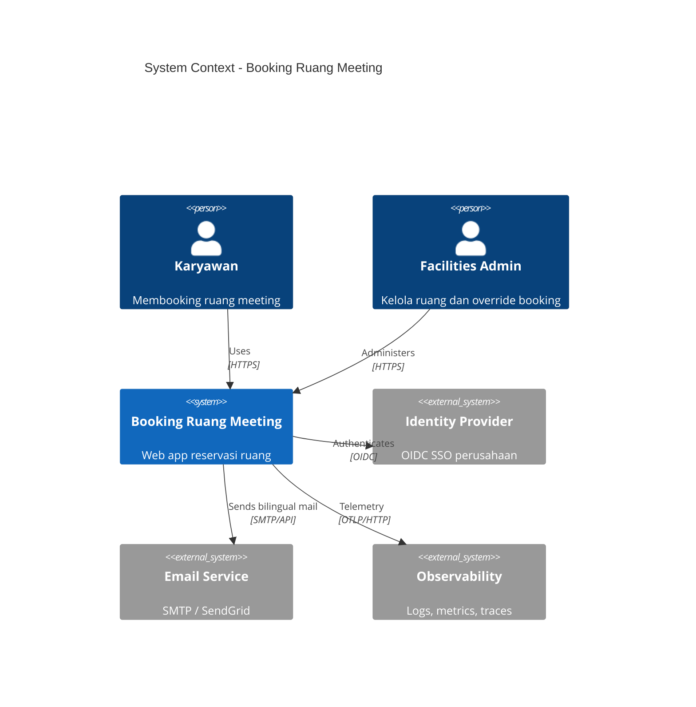
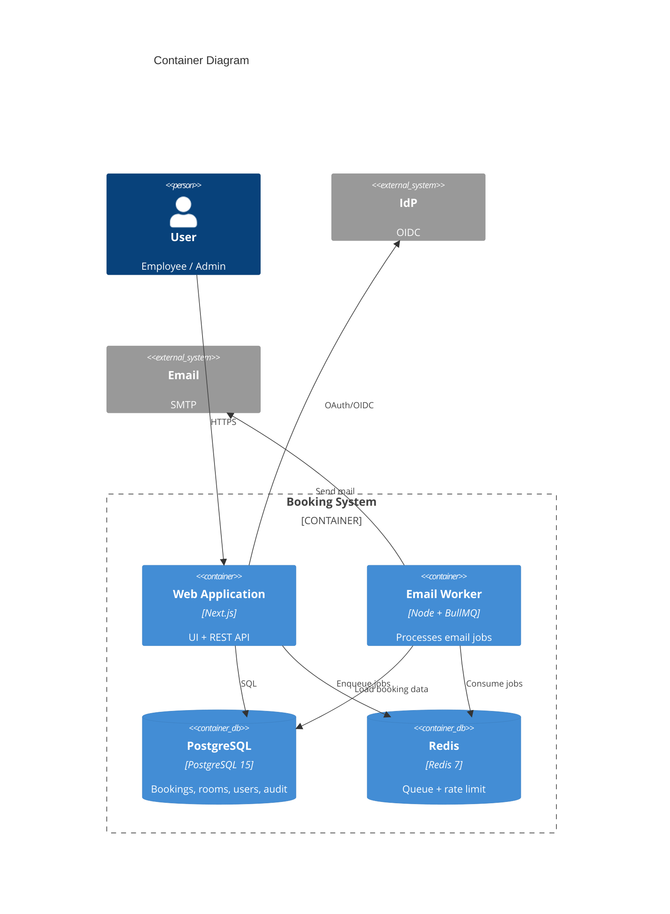

# Architecture Document
# Aplikasi Booking Ruang Meeting

| Metadata | |
|----------|---|
| **Dokumen** | Architecture-Aplikasi-Booking-Ruang-Meeting |
| **Versi** | **1.3** |
| **Tanggal** | 30 September 2026 |
| **Status** | Selaras implementasi MVP — PRD v1.2, BRD v1.2 |
| **Dokumen Terkait** | [BRD](./BRD-Aplikasi-Booking-Ruang-Meeting.md) · [PRD](./PRD-Aplikasi-Booking-Ruang-Meeting.md) · [TDD](./TDD-Aplikasi-Booking-Ruang-Meeting.md) · [Design](./Design-Aplikasi-Booking-Ruang-Meeting.md) |

---

## 1. Introduction

Dokumen ini mendeskripsikan arsitektur sistem booking ruang meeting untuk MVP: context C4, container, komponen utama, keputusan arsitektur (ADR), observability, CI/CD, branch management, dan QA — selaras dengan [TDD](./TDD-Aplikasi-Booking-Ruang-Meeting.md).

**Repositori:** [github.com/ariprasetyoskom/meeting-room-cursor](https://github.com/ariprasetyoskom/meeting-room-cursor) · branch pengembangan `cursor/meeting-room-web-scaffold`.

---

## 2. Goals & Constraints

- **Reliability:** zero double-booking (DB exclusion constraint as source of truth).
- **Simplicity:** monolith Next.js untuk MVP velocity.
- **Async notifications:** BullMQ decouples SMTP latency from API.
- **Security:** internal-only, SSO, RBAC admin vs employee.
- **Evolution:** path to split worker and BFF in Fase 2 without rewrite.

---

## 3. C4 Model

### 3.1 Level 1 — System Context



### 3.2 Level 2 — Containers



### 3.3 Level 3 — Components (Web Application)

| Komponen | Tanggung jawab |
|----------|----------------|
| **Auth Module** | Auth.js (OIDC + `AUTH_MODE=dev`), middleware, `SessionProfileProvider`, `dev-auth-client` |
| **Booking Service** | Business rules D-1, validation, conflict mapping (`23P01` → 409), enqueue email |
| **Room Service** | Active rooms; **admin CRUD** + activate/deactivate |
| **Repositories (Drizzle)** | `rooms`, `bookings`, `audit` repositories |
| **Presentation shell** | `AppShell`, `BrandLogo`, `MainNav`, `AdminNav`, `UserMenu`, `PageHeader` |
| **Calendar UI** | `BookingCalendar`, `RoomPicker`, `BookingModal` — timeline/list **harian** 08–18 WIB |
| **Admin UI** | `AdminRoomsManager`, `AdminBookingsList`, `AdminAuditLogList` (F-08–F-11) |
| **API Layer** | `/api/v1/*`, `/api/health`, Zod, error envelope |
| **Email Worker** | BullMQ consumer — **SMTP + bilingual (D-3) backlog** |
| **Audit Logger** | Append-only audit on booking/room mutations; admin read API |

UI/UX detail: [Design](./Design-Aplikasi-Booking-Ruang-Meeting.md) · status fitur: [PRD §4.1](./PRD-Aplikasi-Booking-Ruang-Meeting.md).

### 3.3.1 Rute aplikasi (MVP)

| Area | Route | API utama |
|------|-------|-----------|
| Employee | `/book`, `/rooms`, `/bookings`, `/login` | `GET/POST /api/v1/bookings`, `GET /api/v1/rooms`, `GET /api/v1/me` |
| Admin | `/admin/rooms`, `/admin/bookings`, `/admin/audit` | `/api/v1/admin/rooms`, `.../bookings`, `.../audit-logs` |
| Ops | — | `GET /api/health` |

### 3.4 Tech Stack (Single Source of Truth)

| Layer | Implementasi `Apps/web` |
|-------|-------------------------|
| App | Next.js **14.2**, React **18**, TypeScript **5** |
| Data | PostgreSQL **15**, **Drizzle ORM**, exclusion constraint custom SQL |
| Async | Redis **7**, BullMQ **6** |
| Auth | next-auth **v5 beta** (Auth.js) |
| Test | Vitest |
| UI styling | CSS design tokens (`globals.css`), Geist fonts |

Port dev Postgres: **5434** (host) — lihat [Devops/docker](../Devops/docker/docker-compose.yml).

---

## 4. Data Flow — Create Booking

```text
User → Next.js UI → POST /api/v1/bookings
  → Booking Service → INSERT bookings (confirmed)
      → OK: BullMQ add confirm email → 201
      → 23P01: 409 ROOM_CONFLICT
Worker → render bilingual template → SMTP → log
```

---

## 5. Security Architecture

- TLS termination at reverse proxy / ingress.
- Secrets in vault or CI masked vars — never in git.
- Principle of least privilege DB user (app role without SUPERUSER).
- Admin actions require `cancel_reason` on forced cancel (audit).

---

## 6. Deployment Architecture (Logical)

| Environment | Purpose | Data |
|-------------|---------|------|
| **local** | Dev | Docker Postgres (**5434**) + Redis **6379** |
| **staging** | QA/UAT | Anonymized subset |
| **production** | Live | HA Postgres, Redis managed |

Infra as code placeholder: [../Devops/infra/README.md](../Devops/infra/README.md).

---

## 7. Architecture Decision Records (ADR)

### ADR-001: Monolith Next.js for MVP

| | |
|---|---|
| **Status** | Accepted |
| **Context** | Small team, tight timeline, unified types UI/API. |
| **Decision** | Single `Apps/web` Next.js app hosts UI and `/api/v1`. |
| **Consequences** | Simple deploy; later extract worker (already separate process) and optionally API. |

### ADR-002: PostgreSQL Exclusion Constraint for Conflicts

| | |
|---|---|
| **Status** | Accepted |
| **Context** | Race conditions on concurrent booking (BR-01). |
| **Decision** | Use `btree_gist` exclusion on `(room_id, tstzrange)` where status = confirmed. |
| **Consequences** | DB migration requires extension; app must handle `23P01`; strong correctness guarantee. |

### ADR-003: BullMQ + Redis for Email

| | |
|---|---|
| **Status** | Accepted |
| **Context** | SMTP slow; API must stay fast; retries needed. |
| **Decision** | Enqueue jobs post-commit; dedicated worker consumer. |
| **Consequences** | Redis dependency; monitor queue depth; idempotent job handlers by bookingId+type. |

### ADR-004: Restricted Cancel Policy (Product D-1)

| | |
|---|---|
| **Status** | Accepted |
| **Context** | Reduce disputes and ghost cancellations. |
| **Decision** | Enforce organizer-only + time window in service layer; admin override with reason. |
| **Consequences** | Support tickets for edge cases; clear UX error messages required. |

### ADR-006: Drizzle ORM + Repository Layer

| | |
|---|---|
| **Status** | Accepted |
| **Context** | Perlu migrasi versioned, type-safe queries, tetap jalankan raw SQL untuk exclusion constraint. |
| **Decision** | Drizzle schema + drizzle-kit; constraint di `drizzle/custom/`; repositories untuk domain access. |
| **Consequences** | Tidak pakai Prisma; tim harus review migrasi + custom SQL di PR. |

### ADR-005: Bilingual Single Email (Product D-3)

| | |
|---|---|
| **Status** | Accepted |
| **Context** | Workforce mixed ID/EN; one notification per event. |
| **Decision** | Template with two sections; single send per event type. |
| **Consequences** | Longer emails; test rendering across clients; no separate locale preference MVP. |

---

## 8. Engineering Standards

### 8.1 Coding & API

- TypeScript strict; ESLint + Prettier.
- API errors: `{ error: { code, message, details? } }`.
- Version prefix `/api/v1`.

### 8.2 Database

- Migrations versioned in repo; reviewed in PR.
- No manual hotfix prod without backport migration.

### 8.3 Observability

| Signal | Tooling (recommended) | What to capture |
|--------|----------------------|-----------------|
| **Logs** | Structured JSON → Loki / CloudWatch | `requestId`, `userId`, route, latency, error code |
| **Metrics** | Prometheus / Datadog | `http_requests_total`, `booking_created_total`, `booking_conflict_total`, `email_job_failures`, queue lag |
| **Traces** | OpenTelemetry → Tempo/Jaeger | Span: API handler → DB → Redis enqueue |
| **Alerts** | Pager/on-call policy | Error rate > 5% 5m; worker queue > 1000; DB connection saturation |
| **Dashboards** | Grafana | Golden signals per service; business KPI counters |

Health endpoint `/api/health` exposes dependency checks for k8s probes.

Correlation: propagate `x-request-id` from edge to worker logs where bookingId present.

### 8.4 CI/CD

Pipeline stages (see [../.github/workflows/ci.yml](../.github/workflows/ci.yml) & [../Devops/ci/README.md](../Devops/ci/README.md)):

1. **Lint & typecheck** — ESLint, `tsc --noEmit`.
2. **Unit tests** — Vitest/Jest.
3. **Integration tests** — Postgres service container; overlap constraint tests.
4. **Build** — `next build`; build worker bundle.
5. **E2E (staging/nightly)** — Playwright on staging.
6. **Deploy staging** — auto on `main` merge (GitHub `deploy-staging` job).
7. **Deploy production** — manual approval or tagged release `v*`.

Artifacts: `.next/` build + container image to GitHub Container Registry / GHCR (opsional).

Database migrations run as pre-deploy job with rollback plan documented.

Secrets via **GitHub Actions secrets** and Environments (`staging`, `production`).

### 8.5 Branch Management

| Branch | Purpose | Rules |
|--------|---------|-------|
| `main` | Production-ready | Protected; require PR + 1 review + green CI |
| `develop` | Integration (optional) | Deploy to staging if used |
| `feature/*`, `cursor/*` | Feature work | Branch from `main`; CI on push; squash merge |
| `fix/*` | Bugfixes | Same as feature |
| `release/*` | Release prep | Version bump, changelog |

Tagging: semver `v1.0.0` for prod releases.

Hotfix: `fix/*` from `main`, cherry-pick if needed, fast-track CI.

No force-push to `main`.

### 8.6 QA

| Phase | Activities | Exit criteria |
|-------|------------|---------------|
| **Test planning** | Trace matrix FR/F vs test cases | Signed QA plan |
| **Functional** | Execute cases: book, conflict, cancel rules D-1, admin, email content D-3 | 100% Must FR pass |
| **Regression** | Automated E2E smoke on staging | Green on release candidate |
| **Performance** | k6: 100 VU read calendar, 20 VU create | P95 < targets in TDD NFR |
| **Security** | Dependency scan; OWASP ZAP baseline | No critical findings unmitigated |
| **UAT** | Facilities + sample employees | Sign-off checklist BRD §13 |

Defect severity: P1 block release; P2 fix or waive with PO approval.

Test data: seed script for rooms and test users in staging only.

---

## 9. Failure Modes & Recovery

| Failure | Detection | Mitigation |
|---------|-----------|------------|
| Redis down | Health fail; enqueue errors | API still books; alert ops; replay emails when up |
| Worker stuck | Queue lag metric | Scale worker; DLQ inspect |
| DB primary down | Health; DB alerts | Failover per infra runbook |
| IdP outage | Auth error spike | Status page; cached session continues until expiry |

---

## 10. Future Architecture (Fase 2)

- Read replicas for calendar queries.
- Outbox table for guaranteed email delivery.
- Calendar sync adapter service.
- PWA (pending OQ-4 in PRD).

---

## 11. Dokumen Terkait

| Dokumen | Path |
|---------|------|
| BRD | [./BRD-Aplikasi-Booking-Ruang-Meeting.md](./BRD-Aplikasi-Booking-Ruang-Meeting.md) |
| PRD | [./PRD-Aplikasi-Booking-Ruang-Meeting.md](./PRD-Aplikasi-Booking-Ruang-Meeting.md) |
| TDD v1.1 | [./TDD-Aplikasi-Booking-Ruang-Meeting.md](./TDD-Aplikasi-Booking-Ruang-Meeting.md) |
| Design (UI/UX) | [./Design-Aplikasi-Booking-Ruang-Meeting.md](./Design-Aplikasi-Booking-Ruang-Meeting.md) |
| Docs index | [./README.md](./README.md) |
| GitHub Actions CI | [../.github/workflows/ci.yml](../.github/workflows/ci.yml) · [../Devops/ci/README.md](../Devops/ci/README.md) |

---

*Akhir dokumen Architecture v1.3.*
