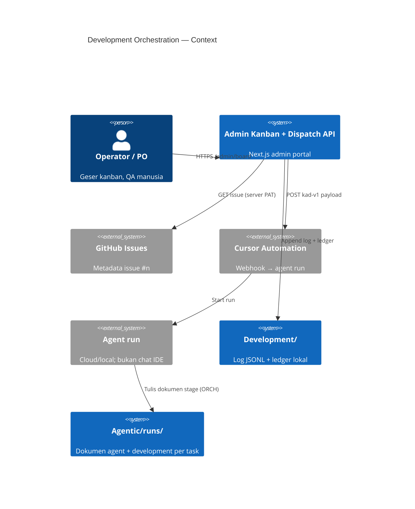
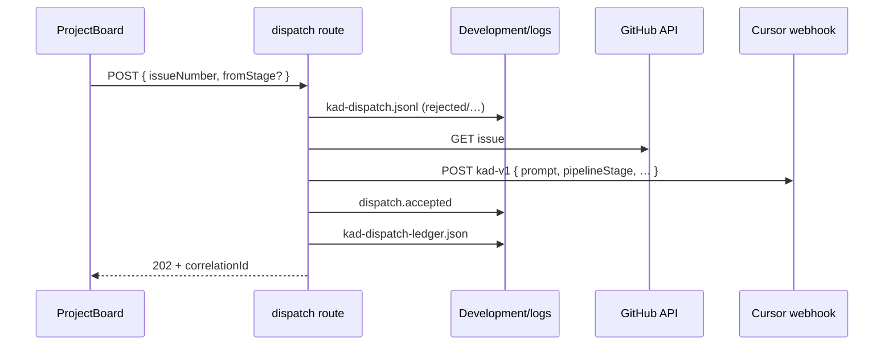

# Architecture — Development Orchestration (ORCH + KAD)

| Metadata | |
|----------|---|
| **Dokumen** | Architecture-Development-Orchestration |
| **Versi** | **1.0** |
| **Tanggal** | 1 Oktober 2026 |
| **Status** | Selaras implementasi papan admin + KAD v1.0; runner ORCH belum diimplementasi |
| **Bahasa** | Indonesia |
| **Dokumen Terkait** | [PRD ORCH](./PRD-Orkestrasi-Manusia-AI.md) · [PRD KAD](./PRD-Kanban-Agent-Dispatch.md) · [Architecture booking](./Architecture-Aplikasi-Booking-Ruang-Meeting.md) · [Development/README.md](../Development/README.md) |

---

## 1. Ringkasan

Lapisan ini menambahkan **orkestrasi development** di atas monorepo booking: papan kanban admin (visual alur), **dispatch event-driven** ke Cursor Automation (KAD), log operasional terpusat di `Development/logs/`, dan (rencana) runner deterministik ORCH dengan dokumen di `Agentic/runs/`.

Booking MVP tetap monolith `Apps/web`; komponen orkestrasi hidup di **admin portal** (`:3001`) dan folder **`Development/`** di root repo — bukan di `Docs/` produk.

---

## 2. Context (C4 — Level 1)

---

## 3. Papan kanban — kolom pipeline

Satu view **Auto development** (`/admin/board`). Kolom (kiri → kanan):

| ID kolom | Label UI | Peran |
|----------|----------|--------|
| `intake` | Intake | Antrian; belum direncanakan |
| `plan` | Plan | Acuan, scope, manifest pelaksana (ORCH v1.1+) |
| `development` | Development | **Satu-satunya kolom yang memicu KAD v1.0** |
| `test` | Test | Verifikasi / bukti lulus |
| `audit` | Audit | Review diff & kontrak (pelaksana ≠ develop) |
| `human_clarify` | Human Clarify | Gate `clarify` ORCH — menunggu jawaban |
| `human_qa` | Human QA | Penerimaan manusia sebelum tutup |
| `done` | Done | Task diterima |

**KAD v1.0:** hanya transisi **menuju** `development` memanggil `POST /api/v1/admin/board/dispatch`. Kolom lain = geser UI (atau ORCH runner di masa depan).

**GitHub Project #1** (Todo / In Progress / Done) tetah terpisah; scheduler 15 m monitor **In Progress** GitHub — bukan kolom pipeline lokal.

---

## 4. Pemetaan kanban ↔ ORCH

| Kolom kanban | Stage mesin ORCH (§4.1 PRD ORCH) | Dispatch / runner |
|--------------|----------------------------------|-------------------|
| Intake, Plan | `queued` (pra-develop) | Manual geser; v1.1 bisa hook Plan |
| Development | `develop` | **KAD** → Automation webhook |
| Test | `test` | Manual / runner ORCH (belum) |
| Audit | `audit` | Manual / runner ORCH (belum) |
| Human Clarify | `waiting_human` (`clarify`) | Manual |
| Human QA | Gate manusia pasca-audit | Manual |
| Done | `done` | Manual |

Runner ORCH nanti **memegang transisi gate** (`pass` / `fail` / `clarify`); kanban v1.0 **mirror visual** — operator geser kartu, kecuali trigger Development yang terhubung KAD.

---

## 5. Container — KAD (implementasi)

| Komponen | Path | Tanggung jawab |
|----------|------|----------------|
| UI papan | `Apps/web/src/components/ProjectBoard.tsx` | Drag/keyboard; rollback jika dispatch gagal |
| Model kartu | `Apps/web/src/lib/project-board.ts` | `BoardStatus`, kolom, `BOARD_DISPATCH_STAGE=development` |
| Kebijakan | `Apps/web/src/lib/board-dispatch-policy.ts` | Lock, debounce, block epic #30 |
| Dispatch service | `Apps/web/src/lib/board-dispatch.ts` | GitHub fetch, webhook, ledger |
| Log terpusat | `Apps/web/src/lib/development-log.ts` | Resolve `Development/logs/` |
| API | `Apps/web/src/app/api/v1/admin/board/dispatch/route.ts` | GET status, POST dispatch, DELETE lock |

### 5.1 Alur dispatch (sequence)

### 5.2 Payload webhook (`source: kad-v1`)

| Field | Deskripsi |
|-------|-----------|
| `prompt` | Instruksi lengkap untuk agent (issue + alur pipeline) |
| `issueNumber`, `repository` | Konteks GitHub |
| `pipelineStage` | Selalu `development` pada v1.0 |
| `fromStage` | Kolom asal kanban (opsional) |
| `correlationId` | UUID; lock ledger |

---

## 6. Folder `Development/` — log terpusat

| Path | Tipe | Isi |
|------|------|-----|
| `Development/logs/kad-dispatch.jsonl` | Append-only JSONL | Event: `dispatch.accepted`, `dispatch.rejected`, `dispatch.webhook_failed`, `lock.cleared`, … |
| `Development/logs/kad-dispatch-ledger.json` | State file | Lock aktif + debounce per issue |
| `Development/logs/*.jsonl` | Reserved | Channel ORCH/runner (`orch-runner`, dll.) |

- **Git:** isi log di-ignore; `Development/logs/README.md` di-track.
- **Override:** env `DEVELOPMENT_LOG_DIR` (server `Apps/web`).
- **Migrasi:** ledger lama `Apps/web/.data/board-dispatch.json` dibaca sekali lalu ditulis ke path baru.

**NFR:** log tidak menyimpan secret webhook atau PAT (hanya metadata: `issueNumber`, `httpStatus`, `correlationId`).

---

## 7. Folder `Agentic/runs/` — bukti stage (ORCH)

Selaras PRD ORCH §4.4 — **bukan** log operasional:

| Path | Isi |
|------|-----|
| `Agentic/runs/{taskId}/agent/{attempt}-{stage}.md` | Rencana + verdict |
| `Agentic/runs/{taskId}/development/{attempt}-{stage}.md` | Hasil + bukti |

Packet ORCH (file ledger runner, belum implementasi) akan mereferensikan path di atas; event dispatch KAD direkam di `Development/logs/`.

---

## 8. Trust boundary & env

| Secret / config | Lokasi | Client bundle |
|-----------------|--------|---------------|
| `CURSOR_AUTOMATION_WEBHOOK_*` | Server `.env.local` | Tidak |
| `GH_DISPATCH_PAT` | Server | Tidak |
| `BOARD_AGENT_DISPATCH_ENABLED` | Server | Hanya flag `enabled` via GET dispatch (admin session) |

Admin session wajib untuk semua route `/api/v1/admin/board/dispatch`.

---

## 9. Hubungan scheduler GitHub

| Sistem | Trigger | Agent |
|--------|---------|-------|
| **SCH** (15 m) | Cron GitHub Actions | Tidak — laporan In Progress |
| **KAD** | Geser → Development | Ya — Automation webhook |

Keduanya complement; jangan polling board untuk dispatch (anti-pattern KAD-02).

---

## 10. Evolusi

| Versi | Target |
|-------|--------|
| KAD v1.1 | Sync Status GitHub Project; release lock on run complete |
| ORCH v0.1 | Parser + state + packet di `Development/logs/` atau subfolder ledger |
| Integrasi | Geser Test/Audit memicu runner stage, bukan hanya UI |

---

## 11. Dokumen terkait

| Dokumen | Path |
|---------|------|
| Runbook KAD | [KANBAN-AGENT-DISPATCH-RUNBOOK.md](./KANBAN-AGENT-DISPATCH-RUNBOOK.md) |
| PRD KAD | [PRD-Kanban-Agent-Dispatch.md](./PRD-Kanban-Agent-Dispatch.md) |
| PRD ORCH | [PRD-Orkestrasi-Manusia-AI.md](./PRD-Orkestrasi-Manusia-AI.md) |

---

*Akhir Architecture Development Orchestration v1.0.*
