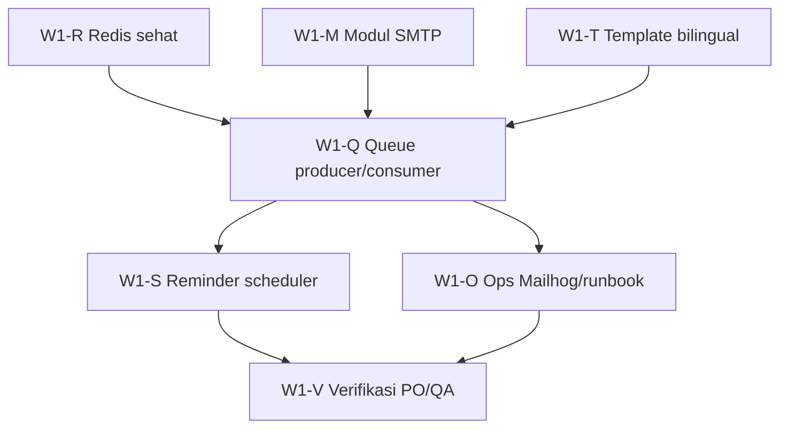

# Wave 1 — Backlog detail: Email & async (F-10)
# Aplikasi Booking Ruang Meeting

| Metadata | |
|----------|---|
| **Dokumen** | PLAN-Wave-1-Email |
| **Versi** | **1.0** |
| **Tanggal** | 30 September 2026 |
| **Durasi** | 2 minggu (Sprint **S4**: 6–17 Okt 2026) |
| **Induk** | [PLAN-MVP-Delivery §4 Wave 1](./PLAN-MVP-Delivery.md) |
| **Trace** | PRD **F-10**, **D-3**, BR **BR-07**, TDD §7, US-08 |

---

## 1. Goal & exit sprint

| Exit | Bukti |
|------|--------|
| Create booking → email bilingual masuk inbox (Mailhog lokal / sandbox staging) | Screenshot + log worker |
| Cancel booking → email cancel bilingual | Idem |
| Reminder ~1 jam sebelum start (OQ-2) | Job terjadwal + 1 contoh terkirim |
| `GET /api/health` → `redis: true` di dev standar | curl / health UI |
| Runbook: dev menjalankan API + `npm run worker:email` | README / Devops |

**Baseline kode:** `email-worker.ts` (confirm + template inline, SMTP stub), `enqueueBookingConfirmEmail` saja; **cancel/reminder belum enqueue**.

---

## 2. Urutan dependency (critical path)

---

## 3. Epic map (W1-01 … W1-05 → ticket)

| Epic PLAN | Epic ID | Ticket count | Owner default |
|-----------|---------|--------------|---------------|
| W1-01 Env SMTP + Ops | **W1-M**, **W1-O** | 7 | Eng + Ops |
| W1-02 Template bilingual | **W1-T** | 5 | Eng + PO |
| W1-03 Reminder | **W1-S** | 4 | Eng |
| W1-04 Redis host→Docker | **W1-R** | 4 | Eng |
| W1-05 Runbook worker | **W1-O**, **W1-V** | 4 | Eng |

---

## 4. Ticket backlog (siap Jira/Linear)

**Estimasi:** story points (SP) relatif; 1 SP ≈ 0,5 hari dev fokus.

### Epic W1-R — Redis & health

| ID | Judul | SP | Depends | Acceptance criteria |
|----|--------|-----|---------|---------------------|
| **W1-R-01** | Dokumentasi dev: `REDIS_URL=redis://127.0.0.1:6379` + troubleshooting Windows | 1 | — | `.env.example`, README; catatan ECONNABORTED |
| **W1-R-02** | Health: pastikan `ping()` connect explisit / timeout 2s | 2 | — | `/api/health` `redis: true` saat container healthy |
| **W1-R-03** | Opsional: `family: 4` / ops ioredis di `connection.ts` jika perlu | 2 | R-01 | Tes lokal Windows + Linux CI |
| **W1-R-04** | CI: job atau doc bahwa health tidak wajib redis hijau di build | 1 | R-02 | Selaras `a00a735` pattern |

### Epic W1-M — Modul SMTP

| ID | Judul | SP | Depends | Acceptance criteria |
|----|--------|-----|---------|---------------------|
| **W1-M-01** | Tambah `nodemailer` + `src/lib/mail/transport.ts` (createTransport dari env) | 2 | — | Throw jelas jika SMTP partial config |
| **W1-M-02** | `sendMail({ to, subject, html })` + log messageId | 2 | M-01 | Unit test dengan mock transport |
| **W1-M-03** | Validasi env: `EMAIL_FROM`, `SMTP_*` di `.env.example` + README Ops | 1 | M-01 | Tabel env selaras TDD §9 |
| **W1-M-04** | Wire worker: ganti stub `SMTP send pending` → `sendMail` | 2 | M-02, T-01 | Create booking + worker → email di Mailhog |

### Epic W1-T — Template bilingual (D-3)

| ID | Judul | SP | Depends | Acceptance criteria |
|----|--------|-----|---------|---------------------|
| **W1-T-01** | Ekstrak template **confirm** ke `src/lib/email/templates/confirm.ts` | 2 | — | Struktur §7.1 TDD (section id + hr + en) |
| **W1-T-02** | Template **cancel** (organizer cancel + admin cancel copy) | 3 | T-01 | Subject bilingual; alasan cancel jika admin |
| **W1-T-03** | Template **reminder** | 2 | T-01 | Waktu id-ID + en-US, TZ WIB |
| **W1-T-04** | Escape HTML field user (`title`, `roomName`, `displayName`) | 2 | T-01 | Test XSS literal `<script>` |
| **W1-T-05** | **PO review** copy ID/EN (checklist 1 halaman) | 1 | T-01–03 | Sign-off PO di ticket / comment |

### Epic W1-Q — Queue producer & consumer

| ID | Judul | SP | Depends | Acceptance criteria |
|----|--------|-----|---------|---------------------|
| **W1-Q-01** | `enqueueBookingCancelEmail(bookingId)` + panggil dari `cancelBooking` | 3 | R-02 | Cancel API → job `email.booking.cancel` |
| **W1-Q-02** | Worker handler: confirm + cancel (switch job.name) | 2 | Q-01, T-02, M-04 | Kedua job terkirim SMTP |
| **W1-Q-03** | Payload job: minimal `bookingId`; load relasi di worker | 1 | — | Pola existing confirm |
| **W1-Q-04** | Observability: log structured `[email] sent` / `failed` + attempts BullMQ | 2 | Q-02 | Grep log demo sprint |

### Epic W1-S — Reminder (OQ-2 default 60 menit)

| ID | Judul | SP | Depends | Acceptance criteria |
|----|--------|-----|---------|---------------------|
| **W1-S-01** | Env `BOOKING_REMINDER_MINUTES_BEFORE=60` (alias dokumentasi OQ-2) | 1 | — | `.env.example` |
| **W1-S-02** | Repeatable job BullMQ **atau** script cron `reminder-scan.ts` | 5 | R-02, T-03, M-04 | Scan `start_at` dalam window; enqueue reminder |
| **W1-S-03** | Idempotency: jangan kirim 2× (flag `reminder_sent_at` kolom **atau** Redis SET) | 3 | S-02 | Dua run scanner → 1 email |
| **W1-S-04** | Worker job `email.booking.reminder` | 2 | S-02, T-03 | E2E: booking +60 menit → reminder inbox |

### Epic W1-O — Infra lokal & runbook

| ID | Judul | SP | Depends | Acceptance criteria |
|----|--------|-----|---------|---------------------|
| **W1-O-01** | Mailhog (atau Mailpit) service di `Devops/docker/docker-compose.yml` | 2 | — | SMTP host `localhost:1025`, UI 8025 |
| **W1-O-02** | `.env.local` contoh dev: SMTP → Mailhog | 1 | O-01 | README langkah book + worker |
| **W1-O-03** | Runbook staging: container worker, `REDIS_URL`, SMTP SendGrid | 2 | M-03 | Doc di `Devops/` atau Architecture §8 |
| **W1-O-04** | `package.json` script opsional `worker:reminder` jika pakai cron terpisah | 1 | S-02 | Documented |

### Epic W1-V — Verifikasi (QA / PO)

| ID | Judul | SP | Depends | Acceptance criteria |
|----|--------|-----|---------|---------------------|
| **W1-V-01** | Skrip manual QA Wave 1 (3 skenario: confirm, cancel, reminder) | 2 | Q-02, S-04 | Checklist `[ ]` → `[x]` + bukti |
| **W1-V-02** | Update PRD §4.1 F-10 → **Selesai** jika lulus | 1 | V-01 | PR commit docs |
| **W1-V-03** | Centang BRD §13 item email bilingual | 1 | V-01 | BRD `[x]` + bukti |
| **W1-V-04** | Demo akhir sprint (15 menit) ke PO/Facilities | 1 | V-01 | Notulen |

**Total SP (indikatif):** ~48 SP → muat 2 minggu dengan 1 dev full-time + buffer PO/Ops.

---

## 5. Jadwal 2 minggu (S4)

### Minggu 1 — Infrastruktur + confirm end-to-end

| Hari | Fokus | Ticket target done |
|------|--------|-------------------|
| **Sen–Sel** | Redis + Mailhog | R-01, R-02, O-01, O-02 |
| **Rab–Kam** | SMTP module + template confirm | M-01–M-04, T-01, T-04 |
| **Jum** | Buffer + PO preview copy | T-05 (draft), Q-03, V-01 partial |

**Milestone M1:** Booking baru → 1 email confirm di Mailhog.

### Minggu 2 — Cancel + reminder + sign-off

| Hari | Fokus | Ticket target done |
|------|--------|-------------------|
| **Sen–Sel** | Cancel pipeline | T-02, Q-01, Q-02, Q-04 |
| **Rab–Kam** | Reminder | S-01–S-04, T-03 |
| **Jum** | Runbook staging + verifikasi | O-03, O-04, V-01–V-04, R-03 jika sisa |

**Milestone M2:** BRD §13 email ✅; siap masuk **Wave 2** (OIDC staging).

---

## 6. Definition of Done per ticket

- [ ] Kode merge ke branch feature `feature/w1-email` (atau scaffold) + CI hijau  
- [ ] Tidak ada secret di repo; env hanya `.env.example`  
- [ ] Acceptance criteria ticket terpenuhi (bukti: log/screenshot/test)  
- [ ] PR deskripsi menyebut ID ticket (`W1-M-04`, dll.)

---

## 7. Risiko & eskalasi Wave 1

| Risiko | Trigger | Aksi |
|--------|---------|------|
| SMTP prod belum dari Ops | Akhir minggu 1 | Lanjut Mailhog; staging SendGrid sandbox |
| Redis Windows tetap flaky | R-03 gagal | Dev di WSL2; staging Linux as source of truth |
| Reminder idempotency scope creep | S-03 > 3 SP | MVP: kolom `reminder_sent_at` on `bookings` |
| Cancel email tanpa alasan admin | PO question | T-02: optional paragraph `cancelReason` |

---

## 8. GitHub Issues & CSV

| Resource | Path / link |
|----------|-------------|
| **CSV lengkap (29 ticket)** | [plan-wave-1-issues.csv](./plan-wave-1-issues.csv) |
| **Issues di GitHub** | [Filter label `wave1`](https://github.com/ariprasetyoskom/meeting-room-cursor/issues?q=label%3Awave1) · milestone **S4 Wave 1 - Email (F-10)** |
| **Script ulang / tambah** | `node Devops/scripts/create-wave1-github-issues.mjs` (skip judul duplikat) |

Issue **#1–#29** map 1:1 ke ID `W1-*` (judul `[W1-R-01] …`).

---

## 9. Dokumen terkait

| Dokumen | Path |
|---------|------|
| PLAN induk | [./PLAN-MVP-Delivery.md](./PLAN-MVP-Delivery.md) |
| TDD email | [./TDD-Aplikasi-Booking-Ruang-Meeting.md](./TDD-Aplikasi-Booking-Ruang-Meeting.md) §7 |
| Worker | `Apps/web/src/workers/email-worker.ts` |
| Queue | `Apps/web/src/lib/queue/email-queue.ts` |

---

*Akhir dokumen PLAN-Wave-1-Email v1.0.*
