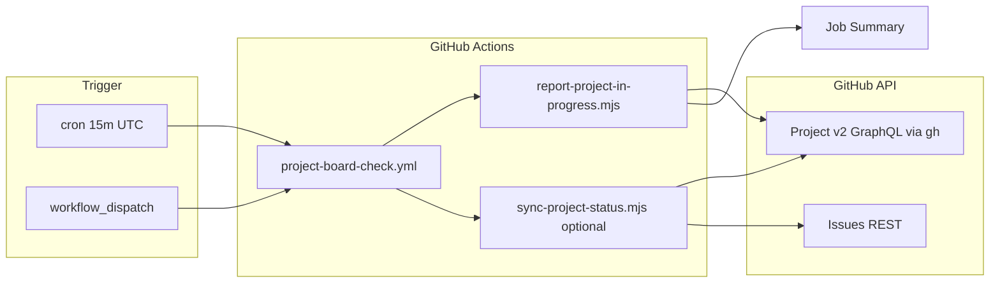

# Product Requirements Document (PRD)
# Scheduler — GitHub Project Kanban (meeting-room-cursor)

| Metadata | |
|----------|---|
| **Dokumen** | PRD-GitHub-Project-Scheduler |
| **Versi** | **1.0** |
| **Tanggal** | 30 September 2026 |
| **Status** | **v1.0 siap deploy** — `run-project-scheduler.mjs` + workflow; butuh secret `GH_PROJECT_PAT` |
| **Bahasa** | Indonesia |
| **Dokumen Terkait** | [GITHUB-PROJECT.md](./GITHUB-PROJECT.md) · [PLAN-MVP-Delivery](./PLAN-MVP-Delivery.md) · [PRD aplikasi](./PRD-Aplikasi-Booking-Ruang-Meeting.md) · [Architecture §8.4 CI](../Architecture-Aplikasi-Booking-Ruang-Meeting.md) |

---

## 1. Ringkasan

Produk **non-user-facing**: job terjadwal yang **memantau** GitHub Project **[meeting-room-cursor #1](https://github.com/users/ariprasetyoskom/projects/1)** — khususnya kartu dengan **Status = In Progress** — dan (opsional) **menyelaraskan** board dengan state issue (closed → Done).

GitHub Projects **tidak** menyediakan cron internal; scheduler hidup di **GitHub Actions** (utama) atau **Task Scheduler Windows** (dev lokal).

**Out of scope aplikasi booking** (F-01–F-12); ini tooling **delivery / PM** untuk Wave 1 & UI Enhance.

---

## 2. Tujuan & Metrik

| Tujuan | Metrik sukses |
|--------|----------------|
| PO/dev tahu apa yang sedang dikerjakan tanpa buka board manual | Laporan In Progress ≥ 1× per interval di Actions Summary |
| Board tidak stale (issue closed tapi kartu In Progress) | Sync otomatis atau alert jika mismatch > 24 jam |
| Aman terhadap rate limit GitHub GraphQL | ≤ 5 mutation per run sync; backoff pada 429 |
| Reproducible di repo | Script + workflow terdokumentasi; secret hanya PAT |

| KPI operasional | Target v1.0 |
|-----------------|-------------|
| Interval default | **15 menit** (konfigurasi cron) |
| Availability scheduler | Actions jalan saat repo aktif (GitHub hosted) |
| Waktu setup pertama | ≤ 20 menit (PAT + secret + verifikasi 1 run) |

---

## 3. Persona

| Persona | Kebutuhan |
|---------|-----------|
| **Product / PM (Cursor)** | Snapshot kartu In Progress (UI-05, Wave 1, epic) |
| **Engineering** | Drift board vs issue closed; log di CI |
| **DevOps** | Secret rotation, cron UTC vs WIB, concurrency |

---

## 4. Keputusan (Locked)

| ID | Keputusan | Implikasi |
|----|-----------|-----------|
| **SCH-01** | **Sumber kebenaran issue** = GitHub Issues; **Status board** = operasional Kanban | Scheduler **membaca** Project; sync **menulis** Status hanya jika fitur sync aktif |
| **SCH-02** | **Interval default 15 menit** via Actions `cron` | Bukan real-time; cukup untuk monitor sprint |
| **SCH-03** | **Auth CI** = secret `GH_PROJECT_PAT` (classic PAT, scope `project`) | `GITHUB_TOKEN` default **tidak** dipakai untuk user Project |
| **SCH-04** | **Project** = user `ariprasetyoskom` **#1**, repo `meeting-room-cursor` | Env `PROJECT_OWNER`, `PROJECT_NUMBER` |
| **SCH-05** | **v1.0 output** = teks di **GitHub Actions Job Summary** | Email/Slack = v1.1 (Could) |

---

## 5. Fitur (F-SCH)

| ID | Fitur | Deskripsi | v1.0 |
|----|-------|-----------|------|
| **F-SCH-01** | Laporan In Progress | Daftar kartu Project dengan Status **In Progress** (#, judul, URL, milestone) | **Must** |
| **F-SCH-02** | Scheduler Actions | Workflow terjadwal + `workflow_dispatch` manual | **Must** |
| **F-SCH-03** | Sync status (opsional) | Closed issue → Done; flag repo `PROJECT_SYNC_ON_SCHEDULE` | **Should** |
| **F-SCH-04** | Sync lokal manual | Script `sync-project-status.mjs` + `gh` di laptop | **Must** (sudah ada) |
| **F-SCH-05** | Deteksi stale WIP | Kartu In Progress > N hari → warning di laporan | **Could** v1.1 |
| **F-SCH-06** | Notifikasi Slack/email | Kirim ringkasan In Progress | **Could** v1.1 |
| **F-SCH-07** | Task Scheduler Windows | Runbook dev tanpa Actions | **Should** (dokumen) |
| **F-SCH-08** | Admin UI on/off | `/admin/scheduler` — variable `PROJECT_SCHEDULER_ENABLED` | **Must** v1.0 |

### 5.1 Status implementasi (30 Sep 2026)

| ID | Status | Bukti |
|----|--------|-------|
| F-SCH-01 | **Selesai** | `run-project-scheduler.mjs` (+ wrapper `report-project-in-progress.mjs`) |
| F-SCH-02 | **Selesai** | `.github/workflows/project-board-check.yml` + validasi secret |
| F-SCH-03 | **Selesai** | `--sync` / `workflow_dispatch` / `PROJECT_SYNC_ON_SCHEDULE` |
| F-SCH-04 | **Selesai** | `GITHUB-PROJECT.md` |
| F-SCH-05–06 | **Belum** | — |
| F-SCH-07 | **Selesai** | Runbook § Scheduler B di `GITHUB-PROJECT.md` |

---

## 6. Functional Requirements

| ID | Requirement | Prioritas | Acceptance |
|----|-------------|-----------|------------|
| **FR-SCH-01** | Setiap run scheduler memanggil API Project (via `gh project item-list`) dan filter `Status == In Progress` | Must | Output memuat semua kartu In Progress yang ada di board |
| **FR-SCH-02** | Cron default `*/15 * * * *` (UTC) dengan override manual | Must | `workflow_dispatch` sukses; schedule terdaftar di Actions |
| **FR-SCH-03** | Run gagal jelas jika PAT missing/invalid | Must | Exit code ≠ 0; log tidak expose token |
| **FR-SCH-04** | Sync hanya mengubah kartu **tidak selaras** (closed ≠ Done) | Should | `--dry-run` menunjukkan diff tanpa edit massal |
| **FR-SCH-05** | Jeda antar mutation ≥ 600 ms (config `PROJECT_SYNC_DELAY_MS`) | Should | Menghindari secondary rate limit |
| **FR-SCH-06** | Laporan JSON untuk integrasi future (`--json`) | Should | Parseable oleh step downstream |

---

## 7. Non-Functional Requirements

| ID | NFR | Target |
|----|-----|--------|
| **NFR-SCH-01** | Timeout job Actions | ≤ 5 menit |
| **NFR-SCH-02** | Concurrency | Satu run aktif (`cancel-in-progress: false`) |
| **NFR-SCH-03** | Secret | PAT disimpan di GitHub Secrets; tidak di repo |
| **NFR-SCH-04** | Audit | Setiap run terlihat di tab Actions (siapa trigger, summary) |
| **NFR-SCH-05** | Idempotency | Laporan read-only idempotent; sync aman diulang |

---

## 8. Arsitektur & Alur

| Komponen | Path |
|----------|------|
| Entry point | `Devops/scripts/run-project-scheduler.mjs` |
| Workflow | `.github/workflows/project-board-check.yml` |
| Sync manual | `Devops/scripts/sync-project-status.mjs` |
| Windows | `Devops/scripts/run-project-scheduler.ps1` |
| Lib | `Devops/scripts/lib/*` |
| Runbook | `Docs/GITHUB-PROJECT.md` |

---

## 9. Konfigurasi

| Nama | Lokasi | Wajib | Deskripsi |
|------|--------|-------|-----------|
| `GH_PROJECT_PAT` | Actions Secret | Ya (CI) | PAT scope `project` |
| `PROJECT_OWNER` | Workflow env | Ya | `ariprasetyoskom` atau `@me` lokal |
| `PROJECT_NUMBER` | Workflow env | Ya | `1` |
| `PROJECT_SYNC_ON_SCHEDULE` | Repo Variable | Tidak | `true` aktifkan sync di cron |
| `PROJECT_SYNC_DELAY_MS` | Workflow env | Tidak | Default `600`–`800` |
| `GITHUB_REPO` | Script env | Tidak | Default `ariprasetyoskom/meeting-room-cursor` |
| `GH_SCHEDULER_ADMIN_TOKEN` | Server `.env` | Ya (UI admin) | PAT: repo + Actions variables read/write |
| `PROJECT_SCHEDULER_ENABLED` | Repo variable | Tidak | `false` = matikan cron (UI toggle) |

---

## 10. Out of Scope (v1.0)

- Mengubah isi issue/PR dari scheduler (hanya Status Project jika sync aktif)
- Multi-project / multi-repo dalam satu job
- Dashboard web custom di luar GitHub
- Mengganti GitHub Project Workflows UI (tetap manual: Item closed → Done)

---

## 11. Release Criteria (v1.0)

- [ ] Secret `GH_PROJECT_PAT` terpasang; 1 run **Project board check** hijau
- [ ] Summary run menampilkan daftar In Progress (contoh: #30 epic, #35 UI-05)
- [ ] Dokumen `GITHUB-PROJECT.md` + PRD ini ter-link dari `Docs/README.md`
- [ ] (Should) Variable sync diuji 1× di staging dengan `--dry-run` log di PR

---

## 12. Roadmap v1.1 (Could)

| Item | Manfaat |
|------|---------|
| FR-SCH stale WIP | Flag kartu In Progress > 3 hari |
| Slack webhook | Push ringkasan ke channel tim |
| Issue comment bot | Post ringkasan harian pada #30 epic |
| Cron WIB jam kerja | `cron` hanya Sen–Jum 01:00–10:00 UTC (08:00–17:00 WIB) |

---

## 13. Open Questions

| ID | Pertanyaan | Status |
|----|------------|--------|
| OQ-SCH-1 | Notifikasi v1.1 via Slack workspace internal? | Open |
| OQ-SCH-2 | Satu kartu In Progress maksimum per Track (WIP limit)? | Open — kebijakan PM |

---

## 14. Dokumen Terkait

| Dokumen | Path |
|---------|------|
| Runbook Kanban | [GITHUB-PROJECT.md](./GITHUB-PROJECT.md) |
| CI utama aplikasi | [`.github/workflows/ci.yml`](../.github/workflows/ci.yml) |
| PRD aplikasi booking | [PRD-Aplikasi-Booking-Ruang-Meeting.md](./PRD-Aplikasi-Booking-Ruang-Meeting.md) |

---

*Akhir dokumen PRD-GitHub-Project-Scheduler v1.0.*
