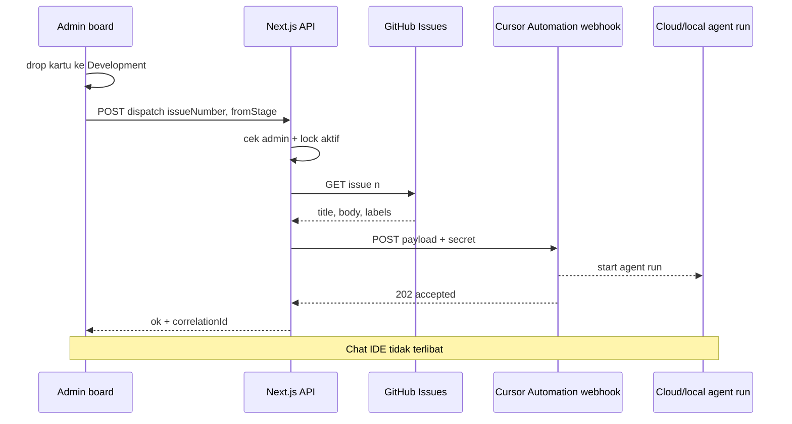

# Product Requirements Document (PRD)
# Kanban → Agent Dispatch (Pipeline Development)

| Metadata | |
|----------|---|
| **Dokumen** | PRD-Kanban-Agent-Dispatch |
| **Identitas PRD** | **KAD** |
| **Versi** | **1.1** |
| **Tanggal** | 1 Oktober 2026 |
| **Status** | v1.0 implementasi — papan 8 kolom ORCH + log `Development/logs/` |
| **Bahasa** | Indonesia |
| **Pemohon** | Sayan |
| **Dokumen Terkait** | [Architecture Development Orchestration](./Architecture-Development-Orchestration.md) · [GITHUB-PROJECT.md](./GITHUB-PROJECT.md) · [PRD-GitHub-Project-Scheduler.md](./PRD-GitHub-Project-Scheduler.md) · [PRD-Orkestrasi-Manusia-AI.md](./PRD-Orkestrasi-Manusia-AI.md) · [Development/README.md](../Development/README.md) |

---

## 1. Ringkasan

KAD menghubungkan **geser kartu ke kolom Development** pada papan admin (`/admin/board`) dengan **pemanggilan agent Cursor baru** yang mengerjakan issue GitHub terkait.

Papan menampilkan alur **automatic development** delapan kolom: **Intake → Plan → Development → Test → Audit → Human Clarify → Human QA → Done** (selaras visual [PRD ORCH §4.5](./PRD-Orkestrasi-Manusia-AI.md)). Hanya masuk **Development** yang memicu dispatch v1.0.

Geser kartu **tidak** membangunkan chat Cursor yang sedang terbuka. Yang dijalankan adalah **run agent terpisah** (Cursor Automation webhook) dengan body `kad-v1` (`prompt`, `pipelineStage`, `fromStage`, …).

Scheduler Project (15 menit) tetap **read-only** — laporan **In Progress** di GitHub Project #1, bukan kolom pipeline lokal. KAD adalah jalur **event-driven** saat operator geser ke Development.

**v1.0** papan lokal + log terpusat `Development/logs/`; sync GitHub Project Status opsional v1.1.

---

## 2. Tujuan & Metrik

| Tujuan | Metrik sukses v1.0 |
|--------|---------------------|
| Geser ke Development memicu agent tanpa mengetik perintah manual | ≥ 95% dispatch sukses (HTTP 2xx + run agent started) pada issue valid |
| Tidak ada tumpukan run paralel untuk issue berbeda tanpa keputusan | Maksimal **1** dispatch aktif per workspace/repo pada v1.0 |
| Operator tahu hasil dispatch | UI menampilkan status: queued, dispatched, rejected, failed |
| Aman untuk secret | URL webhook dan API key tidak ada di bundle client |

| KPI operasional | Target |
|-----------------|--------|
| Waktu dari drop kartu hingga run terlihat | ≤ 30 detik (P95) |
| Rollback UI jika dispatch ditolak | Kartu kembali ke kolom asal ≤ 1 detik |

---

## 3. Persona

| Persona | Kebutuhan |
|---------|-----------|
| **Product / PO** | Geser issue ke Development → agent mulai implementasi acceptance |
| **Engineering** | Satu issue aktif; log di `Development/logs/`; PR dari agent, merge manual |
| **Operator admin** | Feedback jelas bila webhook mati atau issue sudah jalan |

---

## 4. Keputusan Produk (Locked)

| ID | Keputusan | Implikasi |
|----|-----------|-----------|
| **KAD-01** | Hanya transisi **menuju** kolom `development` yang memicu dispatch. | Intake/Plan → Development: ya. Development → Test: tidak. Done → Development: ya (ulang dispatch bila lock/debounce mengizinkan). |
| **KAD-01b** | Delapan kolom kanban (`intake` … `done`) adalah **mirror visual** alur ORCH; v1.0 hanya Development terhubung webhook. | Test/Audit/Clarify/QA: geser manual sampai runner ORCH (F-KAD-07). |
| **KAD-02** | Chat IDE saat geser **bukan** target dispatch. | Integrasi lewat Automation webhook atau SDK server-side. |
| **KAD-03** | **Satu dispatch aktif** global per repo pada v1.0. | Issue B ditolak bila issue A masih `dispatched` / run belum selesai. |
| **KAD-04** | Agent **tidak** merge ke `main` otomatis. | Deliverable = branch + PR (jika Automation/SDK mengaktifkan `autoCreatePR`). |
| **KAD-05** | Instruksi agent wajib memuat: `#n`, judul issue, body/acceptance (dari GitHub), link issue. | Server mengambil metadata via GitHub API; browser hanya mengirim `issueNumber`. |
| **KAD-06** | Secret webhook hanya di server (`Apps/web` env). | Client memanggil `POST /api/v1/admin/board/dispatch` dengan session admin, bukan webhook langsung dari browser ke Cursor. |
| **KAD-07** | Papan lokal v1.0 **tidak** wajib sync ke GitHub Project saat geser. | Drift board lokal vs Project #1 acceptable v1.0; v1.1 Could menulis Status via API. |
| **KAD-08** | Issue **#30 epic** **ditolak** dispatch otomatis (geser sub-issue #31–#40). | Response EPIC + rollback UI. |
| **KAD-09** | Log operasional dispatch dan ledger lock di **`Development/logs/`** (bukan `Apps/web/.data/`). | Channel `kad-dispatch.jsonl` + `kad-dispatch-ledger.json`; gitignored kecuali README. |

---

## 5. Fitur

| ID | Fitur | Deskripsi | Rilis |
|----|-------|-----------|-------|
| **F-KAD-01** | Hook drop Development | Saat kartu masuk kolom Development, panggil API dispatch | v1.0 |
| **F-KAD-01b** | Papan pipeline 8 kolom | Intake … Done; human gate columns highlighted | v1.0 |
| **F-KAD-02** | API dispatch | Validasi admin, lock satu aktif, fetch issue GitHub, POST ke Automation webhook | v1.0 |
| **F-KAD-03** | Rollback UI | Jika dispatch ditolak/gagal, kartu kembali ke kolom asal + pesan | v1.0 |
| **F-KAD-04** | Log + ledger dispatch | JSONL `Development/logs/kad-dispatch.jsonl`; lock `kad-dispatch-ledger.json` | v1.0 |
| **F-KAD-05** | Panel status | Di `/admin/board` atau `/admin/scheduler`: dispatch terakhir, run aktif | v1.0 |
| **F-KAD-06** | Automation template | Instruksi standar: baca issue, kerjakan acceptance, buka PR, jangan merge | v1.0 (dokumen + prefill editor) |
| **F-KAD-07** | ORCH alignment | Dispatch opsional memetakan issue → task id fase / skill (`devops-agent`, dll.) | v1.1 |
| **F-KAD-08** | Sync GitHub Project | Geser lokal + update Status Project via GraphQL | v1.1 |
| **F-KAD-09** | Dispatch dari GitHub Project (webhook GitHub) | Project item → In Progress di GitHub memicu agent tanpa papan lokal | v1.2 Could |

---

## 6. Functional Requirements

| ID | Requirement | Prioritas | Acceptance |
|----|-------------|-----------|------------|
| **FR-KAD-01** | Kartu yang statusnya berubah ke `development` memicu `POST` dispatch | Must | Network tab: satu request; tidak dispatch pada drag dalam kolom yang sama |
| **FR-KAD-02** | Payload `{ issueNumber, fromStage? }` | Must | `fromStage` opsional; masuk log dan prompt agent |
| **FR-KAD-03** | Hanya role admin (selaras `AdminGuard`) | Must | Non-admin 403 |
| **FR-KAD-04** | Lock: tolak dispatch baru jika ledger punya entri `active` | Must | Response 409 + pesan; UI rollback |
| **FR-KAD-05** | Server memanggil GitHub REST `GET /repos/{owner}/{repo}/issues/{n}` | Must | Judul + body masuk prompt webhook |
| **FR-KAD-06** | Server mem-forward ke URL webhook Automation dengan auth header env | Must | Tanpa log body yang memuat secret |
| **FR-KAD-07** | Sukses: kartu tetap Development; badge “Agent aktif”; live region correlationId | Must | Lock tampil di GET dispatch |
| **FR-KAD-08** | Gagal webhook: kartu revert + alert | Must | State board konsisten dengan sebelum drop |
| **FR-KAD-09** | Toggle matikan dispatch (`BOARD_AGENT_DISPATCH_ENABLED=false`) | Should | Geser hanya update UI lokal |

---

## 7. Non-Functional Requirements

| ID | NFR | Target |
|----|-----|--------|
| **NFR-KAD-01** | Latency API dispatch (exclude durasi agent) | P95 ≤ 5 s |
| **NFR-KAD-02** | Idempotency | Dua drop cepat issue sama → satu dispatch (debounce 2 s per issue) |
| **NFR-KAD-03** | Secret | `CURSOR_AUTOMATION_WEBHOOK_URL`, `CURSOR_AUTOMATION_WEBHOOK_SECRET`, `GH_DISPATCH_PAT` hanya server env |
| **NFR-KAD-04** | Audit | Log append-only `Development/logs/kad-dispatch.jsonl`; tanpa secret di body log |
| **NFR-KAD-05** | Rate limit GitHub | Cache issue 60 s per nomor pada request berurutan |

---

## 8. Arsitektur & Alur

| Komponen | Path / lokasi (target implementasi) |
|----------|-------------------------------------|
| UI papan | `Apps/web/src/components/ProjectBoard.tsx` |
| Data kartu | `Apps/web/src/lib/project-board.ts` |
| API dispatch | `Apps/web/src/app/api/v1/admin/board/dispatch/route.ts` |
| Konfigurasi | `Apps/web/src/lib/board-dispatch.ts` |
| Log terpusat | `Development/logs/` via `Apps/web/src/lib/development-log.ts` |
| Ledger lock | `Development/logs/kad-dispatch-ledger.json` |
| Arsitektur | [Architecture-Development-Orchestration.md](./Architecture-Development-Orchestration.md) |
| Runbook Automation | [KANBAN-AGENT-DISPATCH-RUNBOOK.md](./KANBAN-AGENT-DISPATCH-RUNBOOK.md) |

### 8.1 Isi instruksi Automation (ringkas)

Agent wajib:

1. Checkout repo `meeting-room-cursor`, branch `agent/issue-{n}` atau naming seragam.
2. Baca issue `#n` di GitHub (judul, acceptance di body / label).
3. Implementasi + test relevan; tidak ubah scope di luar issue.
4. Buka PR; **jangan** merge.
5. Jika blocker produk → komentar di PR/issue, hentikan dengan status jelas.

Opsional selaras [PRD ORCH](./PRD-Orkestrasi-Manusia-AI.md): tulis `Agentic/runs/issue-{n}/agent/1-develop.md` sebelum kode.

---

## 9. Konfigurasi

| Nama | Lokasi | Wajib v1.0 | Deskripsi |
|------|--------|------------|-----------|
| `BOARD_AGENT_DISPATCH_ENABLED` | Server `.env` | Tidak (default `false`) | Master switch |
| `CURSOR_AUTOMATION_WEBHOOK_URL` | Server `.env` | Ya jika enabled | URL dari Automation setelah save (webhook trigger) |
| `CURSOR_AUTOMATION_WEBHOOK_SECRET` | Server `.env` | Ya jika Automation minta | Header auth; tidak ke client |
| `GH_DISPATCH_PAT` | Server `.env` | Ya jika enabled | PAT `repo` read issues; boleh sama pool dengan scheduler |
| `GITHUB_DISPATCH_REPO` | Server `.env` | Tidak | Default `ariprasetyoskom/meeting-room-cursor` |
| `BOARD_DISPATCH_LOCK_TTL_MS` | Server `.env` | Tidak | Default 4 jam; lepas lock stale (run zombie) |
| `DEVELOPMENT_LOG_DIR` | Server `.env` | Tidak | Override folder log; default `<repo>/Development/logs` |

Client **tidak** menyimpan `CURSOR_API_KEY` untuk dispatch v1.0 (webhook Automation sebagai integrasi utama).

Alternatif v1.1: `CURSOR_API_KEY` + Cursor SDK `Agent.prompt` di server — dokumentasi di TDD KAD.

---

## 10. Hubungan produk lain

| Produk | Relasi |
|--------|--------|
| **Scheduler (SCH)** | Complement: SCH monitor 15 m; KAD trigger on-demand. SCH tidak memanggil agent. |
| **Papan `/admin/board`** | UI trigger v1.0. |
| **ORCH** | Dispatch issue ≠ task PSET; mapping manual atau F-KAD-07. Agent dispatch boleh mengikuti pola dokumen agent/development. |
| **GitHub Project #1** | Sumber kebenaran issue; status board GitHub sync opsional v1.1. |

---

## 11. Out of Scope (v1.0)

- Membangunkan tab chat Cursor yang sedang dibuka user
- Dispatch otomatis untuk semua kartu Development saat halaman load
- Merge otomatis PR agent
- Dispatch paralel multi-issue
- Menutup issue / menulis Done otomatis saat agent selesai
- Mengganti Cursor Automation dengan cron poll board setiap N menit (anti-pattern vs KAD-02)

---

## 12. UX Operator

| Kejadian | Perilaku UI |
|----------|-------------|
| Drop ke Development, dispatch ON | Spinner; sukses → badge “Agent aktif”; tombol lepas lock (dev) |
| 409 lock | Kartu kembali; toast: issue X masih aktif |
| 503 webhook down | Kartu kembali; toast + link runbook |
| Dispatch OFF | Geser seperti sekarang (state lokal saja) |
| Filter / keyboard move | Sama: hanya transisi **ke** Development memicu |

Bahasa UI: **Indonesia**. Label kolom pipeline EN (`Development`, `Human QA`, …); `correlationId` boleh EN.

---

## 13. Kriteria Rilis v1.0

- [ ] `BOARD_AGENT_DISPATCH_ENABLED=true` di staging admin dengan secret terisi
- [ ] Geser `#35` Intake/Plan → Development → run Automation terlihat ≤ 30 s
- [ ] Baris baru di `Development/logs/kad-dispatch.jsonl` untuk `dispatch.accepted`
- [ ] Geser `#36` saat `#35` aktif → 409 + revert kartu
- [ ] Geser ke Done **tidak** memanggil webhook
- [ ] Secret tidak muncul di response API atau bundle JS
- [ ] Runbook Automation + env documented di `Apps/web/.env.example`
- [ ] FR-KAD-01–08 lulus checklist QA manual

---

## 14. Open Questions

| ID | Pertanyaan | Status |
|----|------------|--------|
| **OQ-1** | Runtime agent: **cloud** (VM Cursor) vs **local** (SDK di mesin admin)? | **Open** — v1.0 usulan: **cloud** via Automation; local hanya dev |
| **OQ-2** | Block dispatch untuk epic `#30` (hanya sub-issue)? | **Locked** — epic #30 ditolak (KAD-08) |
| **OQ-3** | Setelah agent selesai, apakah kartu auto Done atau menunggu merge PR? | **Open** — usulan v1.0: **manual** Done; v1.1 hook PR merged |
| **OQ-4** | Satu Automation per repo vs satu Automation per label (`wave1`, `ui-enhance`)? | **Open** |

---

## 15. Glosarium

| Istilah | Arti |
|---------|------|
| **Dispatch** | Server mem-forward permintaan kerja ke Automation webhook |
| **Run agent** | Eksekusi Cursor terpisah dari chat IDE |
| **Lock aktif** | Maksimal satu issue sedang diproses agent (KAD-03) |
| **Rollback UI** | Kartu kembali ke kolom sebelum drop jika dispatch gagal |

---

## 16. Dokumen Terkait

| Dokumen | Path |
|---------|------|
| Papan admin | `Apps/web/src/app/admin/board/page.tsx` |
| Scheduler (bukan dispatch) | [PRD-GitHub-Project-Scheduler.md](./PRD-GitHub-Project-Scheduler.md) |
| Orkestrasi stage | [PRD-Orkestrasi-Manusia-AI.md](./PRD-Orkestrasi-Manusia-AI.md) |
| Board runbook | [GITHUB-PROJECT.md](./GITHUB-PROJECT.md) |

| Runbook | [KANBAN-AGENT-DISPATCH-RUNBOOK.md](./KANBAN-AGENT-DISPATCH-RUNBOOK.md) |
| API | `POST/GET/DELETE /api/v1/admin/board/dispatch` |

---

*Akhir PRD Kanban Agent Dispatch v1.1.*
